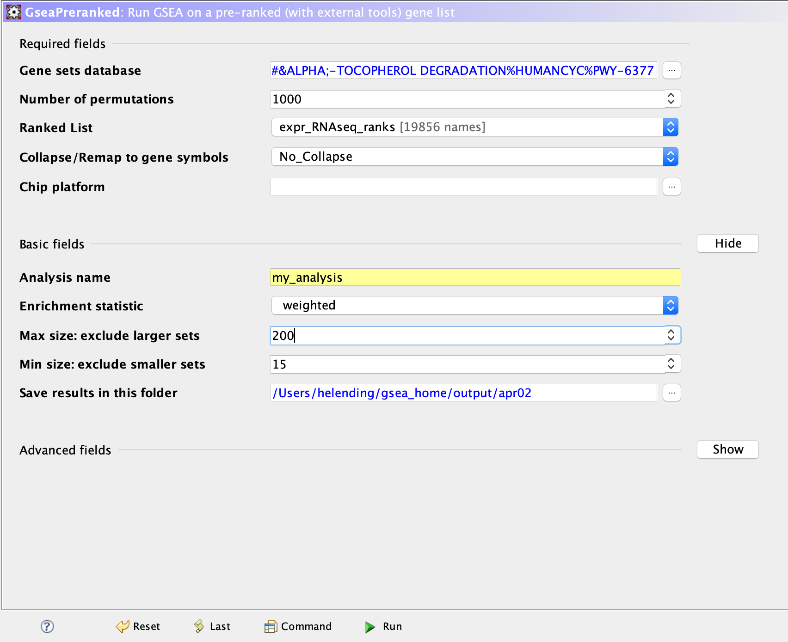
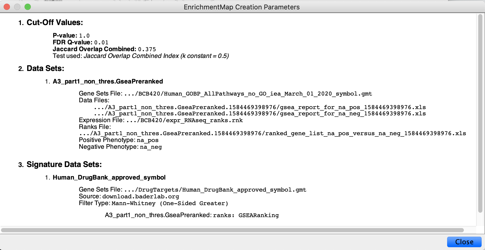
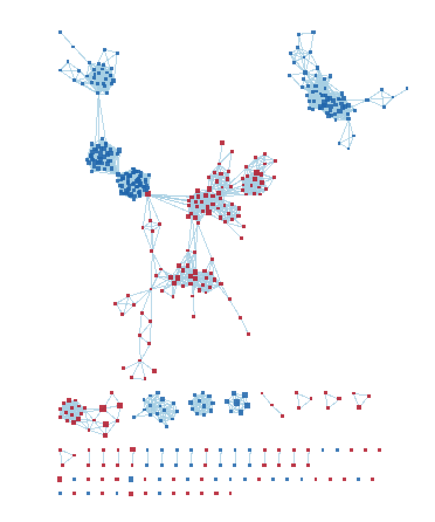
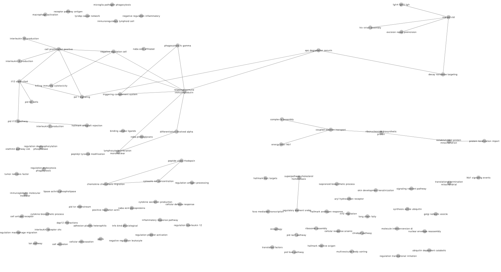
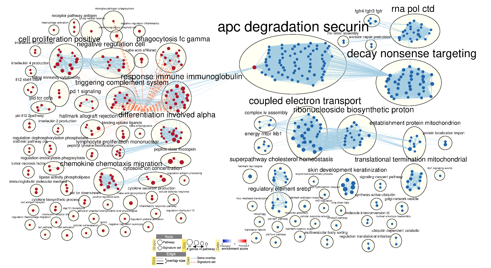

# Part 1: clean and normalize data
My data is from GSE84054 [@goh2017chromosome]. Title: Transcriptome profiling of ER+ breast cancer primary tumor and its tumorsphere derivative.
Overview of the dataset: 12 ER+ primary tumor and tumorspheres. The objective of the authors were to find genes differentially expressed between these two groups.

```{r setup, results="hide", include = FALSE,echo=FALSE}
if (!requireNamespace("BiocManager", quietly = TRUE))
    install.packages("BiocManager")

if (!requireNamespace("limma", quietly = TRUE))
    BiocManager::install("limma")


if (!requireNamespace("edgeR", quietly = TRUE))
    BiocManager::install("edgeR")

if (!requireNamespace("EnsDb.Hsapiens.v75", quietly = TRUE))
    BiocManager::install("EnsDb.Hsapiens.v75")

if (!requireNamespace("knitr", quietly = TRUE))
    BiocManager::install("knitr")
if (!requireNamespace("GEOquery", quietly = TRUE))
    BiocManager::install("GEOquery")
library(limma)
library(edgeR)
library(EnsDb.Hsapiens.v75)
library(knitr)
library(GEOquery)
library(tidyverse)
```

## Download data
```{r download data}
# Download dataset
datafile <- "GSE84054_Rawcount_12patientER.txt.gz"
if (!file.exists(datafile)) {
    datafile <- GEOquery::getGEOSuppFiles('GSE84054', makeDirectory = FALSE)
}
expr <- read.delim(datafile,header=TRUE,check.names=FALSE)
# dim(expr) # 57268    25

# Display rawcount file
kable(expr[1:5,1:10], format = "html")
```

## Check GENEID duplications
It is important to check for GENE ID duplications because we are going to map them to hg19. We need to prevent one to multiple or multiple to one scenarios. It turns out we do not have duplicated GENEIDs.
```{r check GENEID dup, results="hide"}
# NO duplications!
summarized_gene_counts_filtered <- sort(table(expr[,1]),decreasing = TRUE)
length(summarized_gene_counts_filtered[which(summarized_gene_counts_filtered>1)]) # 0
```
## Explore 
```{r boxplot_prefiltered, warning=FALSE, echo=FALSE}
## prefiltered counts
data2plot <- log2(cpm(expr[,2:ncol(expr)]))
boxplot(data2plot, xlab = "Samples", ylab = "log2 CPM", 
        las = 2, cex = 0.5, cex.lab = 0.5,
        cex.axis = 0.5, main = "pre-filtered RNASeq Samples")
#draw the median on each box plot
abline(h = median(apply(data2plot, 2, median)), col = "green", lwd = 0.6, lty = "dashed")
```

```{r density_prefiltered, echo=FALSE, warning=FALSE}
counts_density <- apply(log2(expr[,2:ncol(expr)]), 2, density)
  #calculate the limits across all the samples
    xlim <- 0; ylim <- 0
    for (i in 1:length(counts_density)) {
      xlim <- range(c(xlim, counts_density[[i]]$x)); 
      ylim <- range(c(ylim, counts_density[[i]]$y))
    }
    cols <- rainbow(length(counts_density))
    ltys <- rep(1, length(counts_density))
    #plot the first density plot to initialize the plot
    plot(counts_density[[1]], xlim=xlim, ylim=ylim, type="n", 
         ylab="Smoothing density of log2-CPM",cex.lab = 0.85, 
         main = "Pre-filtered Density distribution")
    #plot each line
    for (i in 1:length(counts_density)) lines(counts_density[[i]], col=cols[i], lty=ltys[i])
    #create legend
    legend("topright", colnames(data2plot),  
           col=cols, lty=ltys, cex=0.75, 
           border ="blue",  text.col = "green4", 
           merge = TRUE, bg = "gray90")
```

```{r MDS_prefiltered, echo=FALSE, warning=FALSE}
## prefiltered MDS plot
plotMDS(d, labels=rownames(samples),
        col = c("darkgreen","blue")[factor(samples$cell_type)], 
        main = "Pre-filtered MDS plot")
```

## Filter out low counts
The objective is to remove the ones with low counts.
Why? Filter weakly expressed and noninformative (e.g., non-aligned) features.
How? We translate out counts into counts per million cpm(),remove features without at least 1 read per million in n of the samples, where n is the size of the smallest group of replicates

```{r filter}
# translate out counts into counts per million
cpms = cpm(expr[,2:25])
rownames(cpms) <- expr[,1]
# get rid of low counts
keep = rowSums(cpms > 1) >= 3
expr_filtered <- expr[keep,]
outliers_removed <- nrow(expr) - nrow(expr_filtered) # 37395
# dim(expr_filtered) # 19873    25

# Display rawcount file
kable(expr_filtered[1:5,1:10], format = "html")
```
## Explore: filtered
```{r boxplot_filtered, echo=FALSE, warning=FALSE}
data2plot <- log2(cpm(expr_filtered[,3:ncol(expr_filtered)]))
boxplot(data2plot, xlab = "Samples", ylab = "log2 CPM", 
        las = 2, cex = 0.5, cex.lab = 0.5,
        cex.axis = 0.5, main = "Filtered RNASeq Samples")
#draw the median on each box plot
abline(h = median(apply(data2plot, 2, median)), col = "green", lwd = 0.6, lty = "dashed")
```

```{r density after filtration, echo=FALSE, warning=FALSE}
counts_density <- apply(log2(expr_filtered[,3:ncol(expr_filtered)]), 2, density)
  #calculate the limits across all the samples
    xlim <- 0; ylim <- 0
    for (i in 1:length(counts_density)) {
      xlim <- range(c(xlim, counts_density[[i]]$x)); 
      ylim <- range(c(ylim, counts_density[[i]]$y))
    }
    cols <- rainbow(length(counts_density))
    ltys <- rep(1, length(counts_density))
    #plot the first density plot to initialize the plot
    plot(counts_density[[1]], xlim=xlim, ylim=ylim, type="n", 
         ylab="Smoothing density of log2-CPM",cex.lab = 0.85, 
         main = "Filtered Density distribution")
    #plot each line
    for (i in 1:length(counts_density)) lines(counts_density[[i]], col=cols[i], lty=ltys[i])
    #create legend
    legend("topright", colnames(data2plot),  
           col=cols, lty=ltys, cex=0.75, 
           border ="blue",  text.col = "green4", 
           merge = TRUE, bg = "gray90")
```

```{r mds after filtration, echo=FALSE, warning=FALSE}
## Filtered MDS plot
plotMDS(d, labels=rownames(samples_filtered),
        col = c("darkgreen","blue")[factor(samples_filtered$cell_type)])
```
## Identifier mapping
```{r identifier mapping, results='hide'}
ensembl_id <- as.character(expr_filtered[,1])

EnsDb_trans_ensembl<- ensembldb::select(EnsDb.Hsapiens.v75,
                                         keys = ensembl_id, 
                                         columns="SYMBOL",
                                         keytype="GENEID")

data.frame(EnsDb_trans_ensembl)
# nrow(EnsDb_trans_ensembl) # 19856 ids mapped
```
## Unmapped GENEIDs
The 17 unmapped gene ids are actually duplicates. The reason why the previous check did not catch them was because if we change the "R" to "0", they can be detected. (They are exactly same, except locating on the Y chromosome). So here I am just going to remove them.
```{r unmapped GENEIDs}
test_filtered <- expr_filtered

# merge mapped df EnsDb_trans_ensembl and unmapped df test_filtered
test_filtered <- merge(EnsDb_trans_ensembl,
                       test_filtered, 
                       by.x=1, by.y=1, all.y=TRUE )
# nrow(test_filtered) # 19873
kable(test_filtered[1:5, 1:5], format = "html")  

# duplicated ensembl id
dup_gene_id <- (test_filtered$GENEID[which(is.na(test_filtered$SYMBOL))])
# length(dup_gene_id) # 17

# display the unmapped ensembl ids
kable(test_filtered[which(is.na(test_filtered$SYMBOL)),][,1:5], format = "html")

# Since I have proved it, I will directly exclude them from expr_filtered
test_filtered <- test_filtered[-which(is.na(test_filtered$SYMBOL)),]
# nrow(test_filtered) # 19856
expr_filtered <- test_filtered
# nrow(expr_filtered) # 19856
rownames(expr_filtered) <- 1:nrow(expr_filtered)
# (num_dup_id <- length(expr_filtered$GENEID[which(duplicated(expr_filtered$GENEID))])) # 0 duplicated

# all(EnsDb_trans_ensembl$GENEID == expr_filtered$GENEID) # TRUE
# all(EnsDb_trans_ensembl$SYMBOL == expr_filtered$SYMBOL) # TRUE
```

## Group samples
Categorize the samples based on their cell types.
```{r samples_filtered}
samples_filtered <- data.frame("patients" = 1:24,"cell_type"=1:24)
rownames(samples_filtered) <- colnames(expr_filtered)[3:ncol(expr_filtered)]

for (i in 1:12){
  samples_filtered$cell_type[i] = "Primary Tumour"
  samples_filtered$patients[i] = i
  samples_filtered$patients[i + 12] = i
}

for (j in 13:24){
  samples_filtered$cell_type[j] = "Sphere"
}

# Add cell_type to sample names
cell_type_indicator <- substring(samples_filtered$cell_type,1,1) # first characters of cell types
rownames(samples_filtered) <- paste0(rownames(samples_filtered), sep="_", cell_type_indicator)

# display grouped format
kable(samples_filtered, format = "html")  
```

## GENE name duplication
  * In A1 I showed that there are 41 duplications (12 unique ones), Ruth sugguested to keep them because it is a very small percent. But I find the MDS plot (color by sample) will be a little messy if I keep them. But color by patient totaly works.
```{r check SYMBOL dup, results='hide'}
dup_gene_name <- sort(table(expr_filtered$SYMBOL),decreasing = TRUE)
length(dup_gene_name[which(dup_gene_name>1)]) # 12
```

## Apply normalization on expr_filtered
```{r}
# need a matrix with only values
filtered_data_matrix <- as.matrix(expr_filtered[,3:ncol(expr_filtered)])

# Rownames be the ensembl id
rownames(filtered_data_matrix) <- expr_filtered$GENEID

# DEGList object
d <- DGEList(counts=filtered_data_matrix, group=samples_filtered$cell_type)

# Normalization
d <- calcNormFactors(d)

# get normalized counts
normalized_counts <- cpm(d)

normalized_counts <- data.frame(normalized_counts)
normalized_counts <- cbind("SYMBOL" = expr_filtered$SYMBOL, normalized_counts)
normalized_counts <- cbind("GENEID" = expr_filtered$GENEID, normalized_counts)
# nrow(normalized_counts) # 19856
# HUGO symbols as rownames of the dataframe
kable(normalized_counts[1:5,1:5], format = "html")
# All rows have a unique HUGO symbols, 
# sum(duplicated(rownames(normalized_counts))) # 0
write.table(normalized_counts, file="GSE84054_normalized_count.txt")
```

# Part 2: DE + thresholded over-representation analysis
* Libraries used in A2:
  * Limma[@limma]
  * Ensembl Hsapiens v75[@EnsDb.Hsapiens.v75]
  * knitr[@knitr]
  * kableExtra[@kableExtra]
  * heatmap[@heatmap]
  * circlize[@circlize]
  * gprofiler2[@gprofiler2]
  
The objective of this second assignment is to explore the differentially expressed genes from the cleaned and normalized data in A1. Then rank the thresholded over-representation analysis to highlight the top terms / dominant themes in the top set of genes. Lastly, compare my result with the original literature and find some other supports as well for my result if possible. I make some changes to my assignment one and stored the file as "ammended_A1.Rmd" and imported it here. I will demonstrate briefly what I have changed in general workflow in A1. My summary of the paper can be found at [my journal](https://github.com/bcb420-2020/student_helen307/wiki/a1) or in A1

```{r setup2, results="hide", include = FALSE,echo=FALSE}
if (!requireNamespace("BiocManager", quietly = TRUE))
    install.packages("BiocManager")

if (!requireNamespace("limma", quietly = TRUE))
    BiocManager::install("limma")

if (!requireNamespace("ComplexHeatmap", quietly = TRUE))
    BiocManager::install("ComplexHeatmap")

if (!requireNamespace("edgeR", quietly = TRUE))
    BiocManager::install("edgeR")

if (!requireNamespace("EnsDb.Hsapiens.v75", quietly = TRUE))
    BiocManager::install("EnsDb.Hsapiens.v75")

if (!requireNamespace("knitr", quietly = TRUE))
    BiocManager::install("knitr")
if (!requireNamespace("gprofiler2", quietly = TRUE))
    BiocManager::install("gprofiler2")

library(limma)
library(edgeR)
library(EnsDb.Hsapiens.v75)
library(knitr)
library(ComplexHeatmap)
library(circlize)
library(gprofiler2)

```


## Load data
Loaded my normalized data from A1.
```{r load norm data}
normalized_count_data <- read.table(file="GSE84054_normalized_count.txt")
kable(normalized_count_data[1:5, 1:5], type="html")
```
## Explore: Normalized 
```{r boxplot_normalized, echo=FALSE, warning=FALSE}
# After normalization
data2plot_after <- log2(normalized_count_data[,3:ncol(normalized_count_data)])
{boxplot(data2plot_after, xlab = "Samples", ylab = "log2 CPM", 
        las = 2, cex = 0.5, cex.lab = 0.5,
        cex.axis = 0.5, main = "Filtered and normalized RNASeq Samples")
abline(h = median(apply(data2plot_after, 2, median)), col = "green", lwd = 0.6, lty = "dashed")}
```

```{r density_normalized, echo=FALSE, warning=FALSE}
counts_density <- apply(log2(normalized_count_data[,3:ncol(normalized_count_data)]), 2, density)
  #calculate the limits across all the samples
    xlim <- 0; ylim <- 0
    for (i in 1:length(counts_density)) {
      xlim <- range(c(xlim, counts_density[[i]]$x)); 
      ylim <- range(c(ylim, counts_density[[i]]$y))
    }
    cols <- rainbow(length(counts_density))
    ltys <- rep(1, length(counts_density))
    #plot the first density plot to initialize the plot
    plot(counts_density[[1]], xlim=xlim, ylim=ylim, type="n", 
         ylab="Smoothing density of log2-CPM",cex.lab = 0.85, 
         main = "Filtered and normalized RNASeq Samples distribution")
    #plot each line
    for (i in 1:length(counts_density)) lines(counts_density[[i]], col=cols[i], lty=ltys[i])
    legend("topright", colnames(data2plot), col=cols, lty=ltys, cex=0.75, 
           border ="blue",  text.col = "green4", merge = TRUE, bg = "gray90")
```

## Differential expression 
1. Calculate p-values for each of the genes in your expression set. How many genes were significantly differentially expressed? What thresholds did you use and why?
* There are 7464 genes that are below the p-value. The threshold I used is 0.05 because this is what the authors of the paper sugguested that they use.
2. Multiple hypothesis testing - correct your p-values using a multiple hypothesis correction method. Which method did you use? And Why? How many genes passed correction?
* I used FDR correction which is also what the authors of the paper specified. 5033 genes passed the correction. Both the p-value and the correction data are based on the edgeR package, not the limma package. I used the limma package up till the point of calculating differential expression like what is sugguested on the lecture notes.
3. Show the amount of differentially expressed genes using an MA Plot or a Volcano plot. Highlight genes of interest.
* I showed a volcano plot using my edgeR fitted data and highlighed the upregulated to be red and down regulated to be blue.
4. Visualize your top hits using a heatmap. Do you conditions cluster together? Explain why or why not.
* My data clustered perfectly according to their cell types which is what my model design based on. My interpretation for the graph would be that since the colors are opposite to each other in the two different cell types, it means that the genes that are upregulated in tumoursphere would be down regulated in primary tumour samples. The shows a great results that the upregulated genes can be potential biomarkers to track if tumoursphere is present or not.

### 1. Choice of factors in my model
* I created the MDS by both using "cell_type" and "cell_type" and "patient". The comparison between the two models is fairly clear: we should only depend on the factor "cell_type", since there seems to be no correlation with each patient.

```{r MDS-1, echo=FALSE, warning=FALSE} 
heatmap_matrix <- normalized_count_data[,3:ncol(normalized_count_data)]
rownames(heatmap_matrix) <- normalized_count_data$GENEID
colnames(heatmap_matrix) <- rownames(samples_filtered)

# MDS plot by "cell_type" in samples
plotMDS(heatmap_matrix, labels=rownames(samples_filtered), 
        col = c("darkgreen","blue")[factor(samples_filtered$cell_type)],
        main = "MDS plot depending on cell type")
```


```{r MDS-2, echo=FALSE, warning=FALSE} 
pat_colors <- rainbow(12)
pat_colors <- unlist(lapply(pat_colors,FUN=function(x){rep(x,2)}))
# MDS plot by "cell_type" + "patients"in samples
plotMDS(heatmap_matrix, col = pat_colors,
        main = "MDS plot depending on both cell type and patients")
```

### 2. Define my model design
Based on the two models in part1, I decide to base my model only on "cell_type"
```{r model} 
model_design <- model.matrix(~ samples$cell_type)
kable(model_design, type="html")
```


### 3. Set up EdgeR object

```{r d object}
d = DGEList(counts=filtered_data_matrix, group=samples$cell_type)
d <- estimateDisp(d, model_design_pat)
#calculate normalization factors
d <- calcNormFactors(d)
```

### 4. Test whether my data is suitable for edgeR - MeanVar plot
I have shown that my data is suitable for using edgeR for further analysis. The data follows the binomial distribution.
```{r meanvar, echo=FALSE, warning=FALSE}
plotMeanVar(d, show.raw.vars = TRUE,                
            show.tagwise.vars=TRUE,                 
            show.ave.raw.vars = TRUE,                                                         
            NBline=TRUE,
            show.binned.common.disp.vars = TRUE,
            main = "Binomial distribution of my data")
```

### 5. Estimate dispersion - BCV plot
The individual dots represent each gene and the blue line is the overall trend line.
```{r BCV, echo=FALSE, warning=FALSE}
plotBCV(d,col.tagwise = "black",col.common = "red", 
        main = "BCV plot of RNA-seq data")
```

### 6. Genes pass threshold and FDR correction 

I used Quasi-likelihood models to fit my data and used QLFTest to test for differential expression. The Quasi-likelihood compares two conditions (primary tumour and tumoursphere) and shows the up and down-regulated genes. The result below that are sorted by p-value. I also inspected the number of genes that satisty my threshold and correction. I choose to use FDR correction based on the paper as well[@goh2017chromosome] . There are 7467 genes pass the p-value = 0.05, and 5033 genes that pass the FDR correction.
```{r threshold and correction}
# fit model
fit <- glmQLFit(d, model_design)

# calculate differential expression
qlf.sphere_vs_tumour <- glmQLFTest(fit, coef='samples$cell_typeSphere')
kable(topTags(qlf.sphere_vs_tumour), type="html")

# Get all the results
qlf_output_hits <- topTags(qlf.sphere_vs_tumour, 
                           sort.by = "PValue", 
                           n = nrow(normalized_count_data))

# Number of genes that pass the threshold p-value = 0.05
# length(which(qlf_output_hits$table$PValue < 0.05)) # 7467

# Number of genes that pass correction
# length(which(qlf_output_hits$table$FDR < 0.05)) # 5033
```

### 7. Up and down-regulated genes

I determined the number of up-regulated genes by selecting every gene that does not pass my p-value: 0.05, and also have a positive log fold change. Down-regulated genes are selected in the same way with a negative log fold change. Stored these data for later enrichment analysis on gProfileR. 

```{r up and down-regulated}
# number of genes that are up regulated
length(which(qlf_output_hits$table$PValue < 0.05 
             & qlf_output_hits$table$logFC > 0)) # 1897

# number of genes that are down regulated
length(which(qlf_output_hits$table$PValue < 0.05  
             & qlf_output_hits$table$logFC < 0)) # 5570

# Get those up and down-regulated genes
qlf_output_hits_withgn <- merge(expr_filtered[,1:2],qlf_output_hits, by.x=1, by.y = 0)

upregulated_genes <- qlf_output_hits_withgn$GENEID[which(qlf_output_hits$table$PValue < 0.05 
                                                         & qlf_output_hits$table$logFC > 0)]

downregulated_genes <-qlf_output_hits_withgn$GENEID[which(qlf_output_hits$table$PValue < 0.05 
                                                           & qlf_output_hits$table$logFC < 0)]


# store data - all differentially expressed
unreg_genes_copy <- data.frame(upregulated_genes)
downreg_genes_copy <- data.frame(downregulated_genes)
names(unreg_genes_copy) <- names(downreg_genes_copy)
all_de <- rbind(unreg_genes_copy, downreg_genes_copy)
colnames(all_de) <- "all_de"
write.table(x=all_de,
            file="all_expr_de_genes.txt",sep = "\t",
            row.names = FALSE,col.names = FALSE,quote = FALSE)

# up regulated
write.table(x=upregulated_genes,
            file="expr_upregulated_genes.txt",sep = "\t",
            row.names = FALSE,col.names = FALSE,quote = FALSE)

# down regulated
write.table(x=downregulated_genes,
            file="expr_downregulated_genes.txt",sep = "\t",
            row.names = FALSE,col.names = FALSE,quote = FALSE)
```

### 8. Show up and down-regulated genes

I have shown the up and down-regulated genes in a volcano plot by coloring them in red and blue, the code is from [@tomatodata2017]
```{r up_volcano, echo=FALSE, warning=FALSE}
volcanoData <- cbind(qlf_output_hits$table$logFC, -log10(qlf_output_hits$table$FDR))
colnames(volcanoData) <- c("logFC", "Pval")

up <- qlf_output_hits$table$FDR < 0.05 & qlf_output_hits$table$logFC > 0
point.col <- ifelse(up, "red", "black")
plot(volcanoData, pch = 16, col = point.col, cex = 0.5,
     main = "Up-regulated genes in RNA-seq data")
```

```{r down_volcano, echo=FALSE, warning=FALSE}
down <- qlf_output_hits$table$FDR < 0.05 & qlf_output_hits$table$logFC < 0
point.col <- ifelse(down, "blue", "black")
plot(volcanoData, pch = 16, col = point.col, cex = 0.5,
      main = "Down-regulated genes in RNA-seq data")
```


### 9. Test Differential expression - heatmap

To test the differential expression, I used the heatmap and it has shown a clear distinction between up and down regulated genes. There is a clear difference between the primary tumour samples and tumoursphere samples.(They are reversed.) The clustering is very obvious to show that differential expression exists.

```{r heatmap, echo=FALSE, warning=FALSE}
top_hits <- rownames(qlf_output_hits$table)[qlf_output_hits$table$PValue<0.05] 
heatmap_matrix_tophits <- t(scale(t(heatmap_matrix[which(rownames(heatmap_matrix) %in% top_hits),]))) 
heatmap_matrix_tophits <- heatmap_matrix_tophits[, c(grep(colnames(heatmap_matrix_tophits),pattern = "_P"), 
                                                    grep(colnames(heatmap_matrix_tophits),pattern = "_S"))]

if(min(heatmap_matrix_tophits) == 0){
    heatmap_col = colorRamp2(c( 0, max(heatmap_matrix_tophits)), 
                             c( "white", "red"))
    } else {
    heatmap_col = colorRamp2(c(min(heatmap_matrix_tophits), 0, max(heatmap_matrix_tophits)), c("blue", "white", "red"))
    }

current_heatmap <- Heatmap(as.matrix(heatmap_matrix_tophits),
                           cluster_rows = TRUE,
                           cluster_columns = FALSE,
                               show_row_dend = TRUE,
                               show_column_dend = FALSE,
                               col=heatmap_col,
                               show_column_names = TRUE, 
                               show_row_names = FALSE,
                               show_heatmap_legend = TRUE,)
current_heatmap
```

## Thresholded over-representation analysis
Are there any gene sets or pathways that are enriched/over-represented or depleted/under-represented in my list?
### Introduction to PART 2:
1. *Which method did you choose and why?*
* I chose to use g:profiler because it shows me the top term names in KEGG, WP, GO and REAC, which is helpful for me when deciding what type of disease it is most likely to be.
2. *What annotation data did you use and why? What version of the annotation are you using?*
* GO biological process:  releases/2019-07-01
* KEGG: KEGG FTP Release 2019-09-30
* Reactome: ensembl classes: 2019-10-2
* WikiPathways: 20190910
3. *How many genesets were returned with what thresholds?*
* The threshold for all the queries: 0.05
* 821 gene sets are returned for all the differentially expressed genes.
* 60 gene sets are returned for up-regulated genes.
* 1333 gene sets are returned for down-regulated genes.

4. Run the analysis using the up-regulated set of genes, and the down-regulated set of genes separately. How do these results compare to using the whole list (i.e all differentially expressed genes together vs. the up-regulated and down regulated differentially expressed genes separately)?
* The up-regulated gene sets are mostly cellular processes and metabolic processes.
* The top terms for down-regulated gene sets are mostly signaling pathways and metabolic processes/
* When running with both up and down-regulated genes, I found that most of them are dominated by the metabolic and cellular processes (up regulated top terms). Therefore, it convinces me the importance of the up-regulated genes in the cancer. And the result aligns with the paper that states the cancer is of subtype "basal".
* Below are my results for each up-regulated, down-regulated, and differentially expressed (both).

### 1. Up regulated genes
There were no REAC found. I used the gprofiler2's function to query data and also attached the screenshots that I took on their website since the package does not show the number of gene sets each has found. 


### 2. Down regulated genes

The some analysis is apply to down regulated


### 3. All differentially expressed genes


## Interpretation questions
1. Do the over-representation results support conclusions or mechanism discussed in the original paper?
* The paper found 1401 genes being up-regulated with fold change > 2 and FDR < 0.05. I found 1312 which is roughly similar. They also found that ALDH family is up-regulated as well. But I found 3 of them in my upregulated genes. The disease is indicated as 31% of basal-like tumors, 12% (HER2)+ tumors and 10% of luminal tumors, since the top terms of my upregulated genes are metabolic processes, therefore, the result aligns with the paper.
* The paper did not mention about the down-regulated genes.
```{r interpretatin questions, results="hide"}
upregulated_genes_sym <- qlf_output_hits_withgn$SYMBOL[which(qlf_output_hits$table$PValue < 0.05 
                                                         & qlf_output_hits$table$logFC > 1)]

length(upregulated_genes_sym) # 1312


upregulated_genes_sym[grep(pattern="ALDH",upregulated_genes_sym)]
# ALDH2, ALDH8A1, ALDH1L2 -> confirmed!
```

2. Evidence that support and how they support your results.

* My result #1: ALDH family is found in my up regulated genes.
Verification of over-representation of ALDH is an important family in breast cancer by [@vassalli2019aldehyde]. They consider ALDH family as a biomarker for breast cancer which sugguests that my result (the fact that up-regulated genes contains the ALDH family is verified). 
* My result #2: top terms of the upregulated genes are mostly cellular and metabolic processes.
[@vasiliou2005analysis] convinces me that my result from g:profiler matches with the basal subtype. The paper states that mutations in ALDH genes causes metabolism errors, for example, Sjögren - Larsson syndrome, type II hyperprolinaemia and γ-hydroxybutyric aciduria and even cancer and Alzheimer's disease. 


# Part 3: non-thresholded + network analysis
The objective of this third assignment is to use the ranked file from A2 and perform non-thresholded analysis with GSEA (Version 4.0.3) [@GSA]. Then the result is compared to the result from thresholded analysis in A2. Finally, cytoscape (Version 3.7.2, Java 1.8.0_162 by Oracle Corporation)[@lopes2010cytoscape] is used to help to create a visualization of the up and down regulated genes along with annotations from the Bader lab. Post analysis is performed with drugBank datasets from Bader lab as well. Other details such as performing the analysis of cytoscape can be retrieved from [my Journal](https://github.com/bcb420-2020/student_helen307/wiki/a3)

R Libraries used: 

* RCurl[@RCurl]
* knitr[@knitr]
* kableExtra[@kableExtra]
* GSA[@GSA]

```{r setup3, results="hide", include = FALSE,echo=FALSE}

if (!requireNamespace("BiocManager", quietly = TRUE))
    install.packages("RCurl")

if (!requireNamespace("BiocManager", quietly = TRUE))
    install.packages("GSA")

if (!requireNamespace("BiocManager", quietly = TRUE))
    install.packages("knitr")

if (!requireNamespace("BiocManager", quietly = TRUE)){
    install.packages("kableExtra")
}

library(RCurl)
library(GSA)
library(knitr)
library(kableExtra)
```
## Non-thresholded Gene set Enrichment Analysis
Are there any gene sets or pathways that are ranked surprisingly high or low in my ranked list?

### 1.Get Bader lab gene sets
* The code is inspired by lecture notes: non-thresholded analysis unit.
```{r, warning=FALSE}
gmt_url = "http://download.baderlab.org/EM_Genesets/current_release/Human/symbol/"
# list all the files on the server
filenames = getURL(gmt_url)
tc = textConnection(filenames)
contents = readLines(tc)
close(tc)
# get the gmt that has all the pathways and does not include terms inferred from
# electronic annotations(IEA) start with gmt file that has pathways only
rx = gregexpr("(?<=<a href=\")(.*.GOBP_AllPathways_no_GO_iea.*.)(.gmt)(?=\">)", contents, 
    perl = TRUE)
gmt_file = unlist(regmatches(contents, rx))
download.file(paste(gmt_url, gmt_file, sep = ""), destfile = dest_gmt_file)
```

### 2. Compute ranks 
* I obtained the rank file, computed the ranks and sorted table by ranks. The output file is "expr_RNAseq_ranks.rnk" which is to be loaded into GSEA for further analysis.
* rank = -log10(p-val)*sign(logFC)

```{r}
# compute ranks
qlf_output_hits_withgn[,"rank"] <- log(qlf_output_hits_withgn$PValue, base = 10) * sign(qlf_output_hits_withgn$logFC)

# sort table by ranks
qlf_output_hits_withgn <- qlf_output_hits_withgn[order(qlf_output_hits_withgn$rank),]

# write gene name and rank to table
write.table(x=qlf_output_hits_withgn[, c(2, ncol(qlf_output_hits_withgn))],
            file="expr_RNAseq_ranks.rnk",sep = "\t",
            row.names = FALSE,col.names = FALSE,quote = FALSE)
kable(head(qlf_output_hits_withgn), caption = "Expr_RNAseq_ranks", format="html") %>%
  kable_styling(bootstrap_options = "hover")
```


### 3. Conduct non-thresholded gene set enrichment analysis

I used the computed ranked set of genes to compute the non-thresholded gene set entichment analysis with GSEA_4.0.3.[@GSA] I loaded the rank file "expr_RNAseq_ranks.rnk" and Bader Lab gene set "human_GOBP_AllPathways_no_GO_iea_March_01_2020_symbol.gmt". The parameters are permutation = 100, no collapse, max = 200, min = 15. The file obtained is: "A3_part1_non_thres.GseaPreranked.1584469398976". Here is a screenshot before performing the analysis on GSEA.



### 4. Summarize enrichment results

My data is divided into "POS" and "NEG" which correspond to up-regulatedand down-regulated genes. 

* For the "POS" group, 
  * Humoral immune response is the top term 
  * P-val = 0, 
  * 9 genes in its leading edge
  * The top gene associated with this geneset is IGKV2D-28. 

```{r, echo=FALSE}
pos <- read.delim("/Users/helending/Desktop/bcb420/gsea_result/gsea_report_for_na_pos_1584469398976.xls")
kable(head(neg[,c(1, 4, 5, 6, 7, 8, 9, 10, 11)]), caption = "Down-regulated_top_terms", format="html") %>%
  kable_styling(bootstrap_options = "hover")
```

* In the "NEG" group, 
  * TGF beta receptor is the top term
  * P-val = 0
  * 185 genes in its leading edge
  * The top gene associated with is PRKCB.

```{r, echo=FALSE}
neg <- read.delim("/Users/helending/Desktop/bcb420/gsea_result/gsea_report_for_na_neg_1584469398976.xls")
kable(head(neg[,c(1, 4, 5, 6, 7, 8, 9, 10, 11)]), caption = "Down-regulated_top_terms", format="html") %>%
  kable_styling(bootstrap_options = "hover")
```

### 5. Compare to the results from thresholded analysis

I used g:profiler in A2 to conduct thresholded analysis. The result showed that both the up-regulated and the down-regulated genes have metabolic terms associated. Whereas using the non-thresholded methods, immune response seems to be associated with up-regulated genes. Beta-receptor seems to be associated with the down-regulated group which is the same as the result from g:profiler. Both thresholded and non-thresholded over-representation analysis shows that the disease is associated with immune response and metabolic malfunctions. Such result is consistent with the result from the paper, and I have found some of the evidences from the other papers in A2, showing that breast cancer is associated with these top terms.


## Visualize Gene set Enrichment Analysis

### 1. Create an enrichment map

* The following visualization is conducted using Cytoscape [@lopes2010cytoscape]
* The parameters I used when creating the enrichment map: FDR was set to 0.01, others are kept as default.
* Basic information: there are 456 nodes and 5087 edges in the resulting map.
* Here is a screenshot that gives information about the creation of the enrichment map.


### 2. Annotate the enrichment map

I defined the main biological themes by using clicking on "auto annotate" -> "annotate". The system created circles around each cluster which corresponds to the most frequent node lavles in the cluster. Here is a screenshot of the overview.


### 3. Manually edit the network

* I made sure that there is no overlap between the labels and the nodes. I also oragnized them to make the interactions clearer. The legend is obtained from Bader lab's website. 
* I did not screenshot the network since it is the same as the resulting graph that also contains the two drugs I picked. The screenshot can be found in the section: " Post analysis - Drug Bank".

### 4. Collapse to a theme network
* Generally, the major themes I found after collapsing the annotated network: immune responses, cell proliferation, tageting, and signaling.There seems to be no novel pathways. 
* Here is an overview of the collapsed graph.



### 5. Interpretation of the annotated network
* Terms on the left are up-regulated genes and terms on the right are down-regulated genes. The lines shows us the interactions between each most frequent terms.
* On the left side, we can see that the term that has the most interactions with the rest is "response immune immunoglobulin". It is connected to terms like "lymphocyte proliferation", "differentiation", "negative cell regulation", "signaling", etc. Elevated level immunoglobulin antibodies is frequently observed in cancers of epithelial origin, including carcinomas of breast, colon, and liver.[@qiu2003human] Therefore, it justifies the reason why this term is up-regulated.
* On the right side, we notice the main term is "APC dedegradation" (with the most genes). Antigen presenting cells (APCs) are immune cells that specialize in presenting an antigen to a T-cell. APC protein acts as a tumor suppressor, therefore, the degradation of APC means that the suppressor is no longer fully supplied which can not stop the disease from expanding. Other terms are related to cell * transport, etc.
* In conclusion, those terms are predicted by the g:profiler in A2 even if they don't have the exact same names. Therefore, we can conclude that the disease is mostly due to immune response malfunction, which then leads to problems in cell metabolism in various ways.

### 6. Post analysis - Drug Bank

The reason why I choose to do the post analysis with drugs is because the paper mentioned about finding a target for a drug. The drug is Pacritinib. However, this drug is not annotated, and thus not stored in the Bader Lab file. Therefore, I chose the top drug (Abciximab) [@law2014drugbank] from Bader lab approved drugs file. The paper also mentioned that they use Gemcitabine to treat breast cancer if the disease does not expand further. 

* Parameters: Mann Whiteney(One-sided greater): since I do not care whether it targets the up-regulated or down-regulated genes.

* The resulting graph shows that there are no connection for Gemcitabine with any pathways, and a lot of up-regulated genes are targeted by Abciximab. The terms that are targeted are mostly the up-regulated genes, such as "response immune immunoglobin", to reduce the elevated level of the antibody. It also reduces the level of other cell metabolic terms that are in the same pathway as the "response immune immunoglobin" (discussed in the section above). The main function of this drug is to reduce antibodies, and other over-produced molecules, but not elevating the weak terms (the down-regulated genes). 

* The only thing not expected is that Gemcitabine does not target the term "cell proliferation positive" which is what the main object of Gemcitabine. Gemcitabine is a drug that kills the fast-growing cells. Therefore, it is not expected to see that this drug does nothing in this disease pathway.

* It might be hard to see the Gemcitabine, it is right beside Abciximab,.



# References
